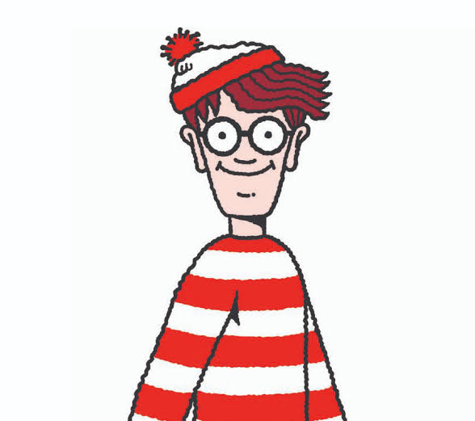
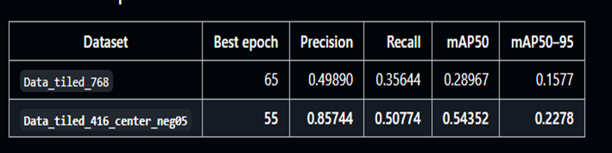
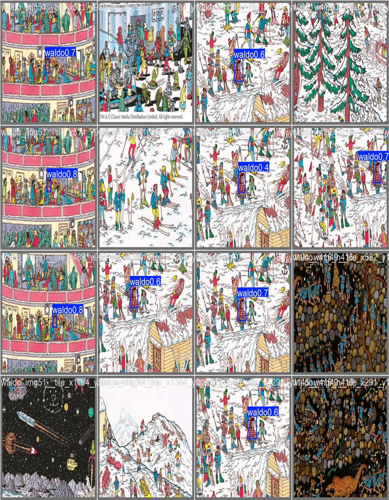
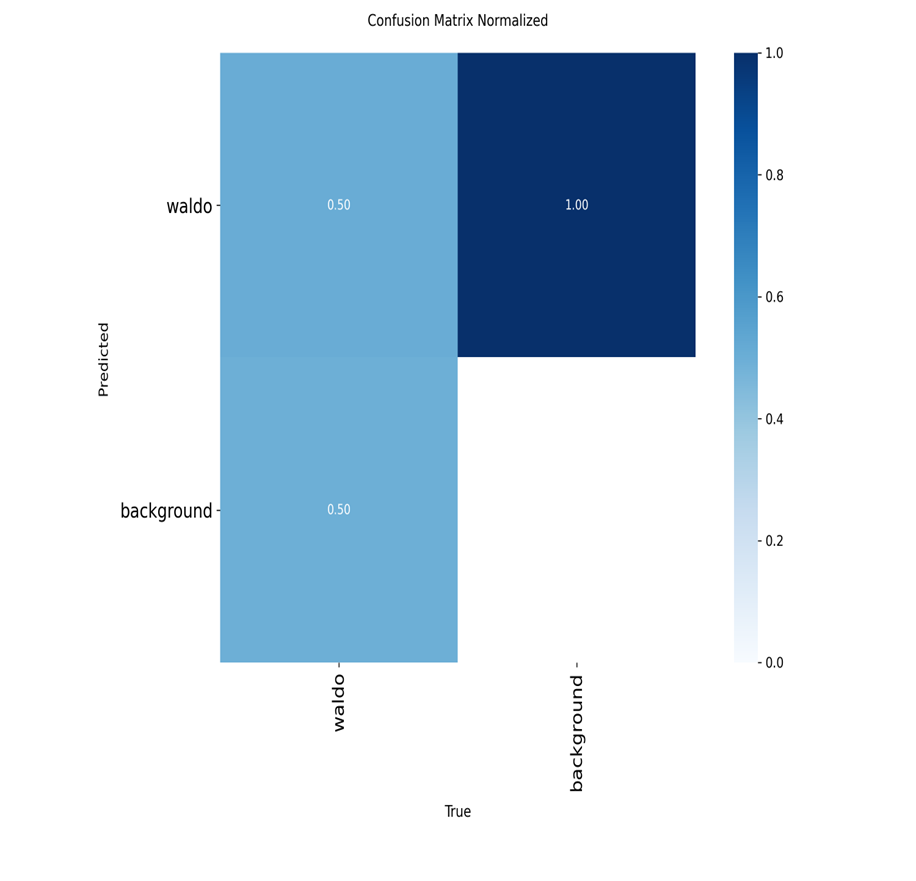
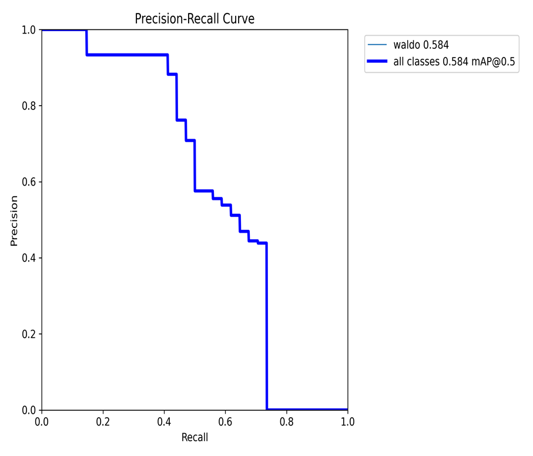

<p align="center">
  
</p>

<h1 align="center">🔎 Where's Waldo?</h1>

<p align="center">
  <strong>Tiny-object localisation with a tiled YOLO26s detector and a training-free Gemini VLM workflow</strong>
</p>

<p align="center">
  
  
  
  
</p>

<p align="center">
  <a href="https://github.com/ACM40960/projects-jinchi-wenhao">Repository</a> ·
  <a href="#-quick-start">Quick Start</a> ·
  <a href="#-results">Results</a> ·
  <a href="#-project-poster">Poster</a>
</p>

---

## 🧰 Tech Stack

| Area | Technology |
|---|---|
| Language | Python 3.10+ |
| Object detection | Ultralytics YOLO26s |
| Vision-language model | Gemini 3.5 Flash via `google-generativeai` |
| Image processing | Pillow |
| Evaluation | Precision, recall, mAP@0.5, mAP@0.5:0.95, confusion matrix and PR curve |

## 📝 Abstract

Finding Waldo is a challenging tiny-object detection problem: he occupies only a small fraction of a crowded illustration, may be partly occluded, and is surrounded by visually similar distractors. This project compares two complementary approaches:

1. a **tiled YOLO26s detector** trained on object-centred Waldo tiles; and
2. a **training-free Gemini vision-language workflow** that classifies overlapping patches and verifies competing candidates.

The strongest YOLO configuration used 416 × 416 centred tiles and achieved **0.857 precision**, **0.508 recall**, **0.544 mAP@0.5** and **0.228 mAP@0.5:0.95**. The VLM workflow instead uses deterministic tiling and binary visual decisions to find likely Waldo regions without training a detector. In patch-level evaluation, it reached **94.4% recall** with a **4.9% false-positive rate**; a single-candidate fast-path scene completed in about **33 seconds** at an estimated API cost of **$0.09**. Across both methods, tiling is the key idea: it preserves the small visual details that disappear when an entire high-resolution scene is downscaled.

## 🎯 Project Description

*Where's Waldo?* scenes are deliberately difficult for computer vision:

- **Tiny target:** Waldo may occupy less than 0.1% of the full image.
- **Heavy clutter:** hundreds of characters compete for attention.
- **Look-alike distractors:** red-and-white stripes, glasses and hats are repeated throughout the scene.
- **Occlusion:** Waldo's most recognisable features may be partly hidden.

To study this problem from two directions, the project implements both a supervised detector and a training-free VLM workflow.

| | Method A: Tiled YOLO26s | Method B: Gemini VLM workflow |
|---|---|---|
| Learning setup | Trained single-class detector | No task-specific training |
| Tile size | 416 × 416 | 256 × 256 |
| Core decision | Bounding-box prediction | Binary “Waldo present?” classification |
| Final localisation | Map detections back and apply cross-tile NMS | Verify candidates, then map the winner back |
| Main trade-off | Needs labelled training data | Needs repeated VLM API calls |

## 🧭 Methodology

### Method A — Tiled YOLO26s Detector

The YOLO pipeline treats Waldo as a single object class.

1. **Prepare tiles.** Split each crowded scene into 416 × 416 tiles, including object-centred positive tiles and carefully selected background-only negatives.
2. **Train the detector.** Fine-tune YOLO26s to detect Waldo while retaining enough local context around the tiny target.
3. **Run tiled inference.** Examine overlapping tiles independently so Waldo is not lost during full-image resizing.
4. **Restore full-image coordinates.** Translate tile-level boxes back to the original scene and remove duplicates with non-maximum suppression.

The experiments compared 768-pixel tiles with 416-pixel centred tiles. The smaller centred configuration preserved the target at a more useful scale and produced the best validation result at epoch 55.

### Method B — Training-Free Gemini VLM Workflow

This route uses deterministic control flow; the VLM acts only as a classifier and candidate comparator.

```text
Full-resolution scene
        ↓
256 × 256 overlapping tiles (15% overlap)
        ↓
Gemini binary detection: “Is Waldo present?”
        ↓
0–1 candidate ───────────────→ map to original image
2+ candidates → compare once → map the winner to original image
        ↓
Draw the final bounding box
```

Key design choices:

- The last tile in each row and column is snapped to the image edge so no region is missed.
- Up to 10 tile requests are evaluated concurrently.
- Filtering uses only the binary `present` signal. Gemini's numeric confidence contradicted its own answer in **77%** of evaluated patches, so confidence-based ranking was rejected.
- Candidate verification is skipped when there is nothing to disambiguate; multiple candidates are compared together in one request and forced into a single choice.

## 🗂️ Project Structure

```text
projects-jinchi-wenhao/
├── agent/                         # VLM workflow and deterministic orchestration
│   ├── pipeline.py                # segment → detect → optional verify → visualise
│   └── nodes/                     # individual workflow stages
├── llm/                           # VLM interfaces and Gemini provider
├── vision/                        # tiling, cropping and coordinate mapping
├── yolo/                          # YOLO data, training, prediction and evaluation code
│   ├── train_tiled_waldo.py
│   ├── predict_tiled_waldo.py
│   ├── evaluate_tiled_original.py
│   ├── final_summary/             # selected experiment metrics
│   └── runs/detect/               # checkpoints and evaluation plots
├── web/index.html                 # browser demo
├── tests/                         # 58 unit tests; no API key required
├── original-images/               # example Waldo scenes
├── main.py                        # command-line entry point
├── serve.py                       # local browser demo server
└── handler.py                     # AWS Lambda-compatible request handler
```

## 🚀 Quick Start

### 1. Clone and install

```bash
git clone https://github.com/ACM40960/projects-jinchi-wenhao.git
cd projects-jinchi-wenhao
python -m venv .venv
python -m pip install -r requirements.txt
```

Activate the virtual environment, then add your Google AI Studio key to a `.env` file:

```env
GOOGLE_API_KEY=your_key_here
```

`python-dotenv` is optional if you prefer `.env` loading:

```bash
python -m pip install python-dotenv
```

### 2. Run the VLM workflow

```bash
python main.py original-images/1.jpg
```

The annotated result is written to `outputs/<image-name>_result.jpg`.

For the browser demo:

```bash
python serve.py
```

Then open `http://127.0.0.1:8000/`.

### 3. Run tiled YOLO inference

```bash
python -m pip install -r yolo/requirements.txt
python yolo/predict_tiled_waldo.py \
  --weights yolo/runs/detect/waldo_tiled_416_center_neg05_s_80_tuned/weights/best.pt \
  --source original-images/1.jpg \
  --tile-size 416 \
  --overlap 0.30 \
  --imgsz 640 \
  --conf 0.05
```

## 📊 Results

### YOLO26s quantitative results

| Dataset configuration | Best epoch | Precision | Recall | mAP@0.5 | mAP@0.5:0.95 |
|---|---:|---:|---:|---:|---:|
| `data_tiled_768` | 65 | 0.49890 | 0.35644 | 0.28967 | 0.15775 |
| **`data_tiled_416_center_neg05`** | **55** | **0.85744** | **0.50774** | **0.54352** | **0.22785** |

<p align="center">
  
</p>

The 416-pixel object-centred dataset substantially improved precision and mAP@0.5 over the 768-pixel setup. The remaining recall gap reflects the small training set and the wide visual variation across crowded scenes.

<p align="center">
  
</p>

<table>
  <tr>
    <th>Normalised confusion matrix</th>
    <th>Precision–recall curve</th>
  </tr>
  <tr>
    <td></td>
    <td></td>
  </tr>
</table>

### VLM quantitative and qualitative results

The VLM pipeline successfully localised Waldo across representative scenes using both the single-candidate fast path and cross-candidate verification.

| Metric | Result | Scope |
|---|---:|---|
| Patch recall | **94.4%** | Patch-level binary detection |
| False-positive rate | **4.9%** | Patch-level binary detection |
| Fast-path latency | **~33 s** | Single-candidate scene; verification skipped |
| Estimated API cost | **~$0.09 / scene** | Same single-candidate fast path |

The experiments also confirmed that Gemini's numeric confidence is not a reliable ranking signal: it contradicted the binary `present` answer in **77%** of evaluated patches. The workflow therefore filters only on the binary answer and uses cross-candidate verification when several tiles are positive.

> [!IMPORTANT]
> YOLO values above are detector validation metrics, while the VLM recall and false-positive rate are patch-level metrics and its latency/cost figures describe the single-candidate fast path. End-to-end bounding-box IoU has not yet been quantified on a shared benchmark, so the two methods should not be ranked directly from these results.

## 🖼️ Project Poster

The poster summarises the motivation, both workflows, quantitative and qualitative results, conclusions and future work.

<p align="center">
  <a href="docs/assets/waldo-poster.pdf"><strong>📄 View / Download the Project Poster (PDF)</strong></a>
</p>

## 🔭 Limitations and Future Work

- Build a shared ground-truth evaluation set and report end-to-end IoU-based localisation accuracy for both methods.
- Expand the YOLO training data and test stronger augmentation, including colour variation, cropping, scaling, occlusion and synthetic scenes.
- Compare tile sizes and overlap ratios under a consistent accuracy, latency and cost protocol.
- Improve API error handling and continue the planned AWS Lambda deployment work.

## 👥 Contact

- [Wenhao Zhang](https://github.com/WenhaoZhang0223)
- [Jinchi Tang](https://github.com/78t87tg)

---

<p align="center">
  Built as an ACM40960 project · <a href="https://github.com/ACM40960/projects-jinchi-wenhao">View the repository</a>
</p>
