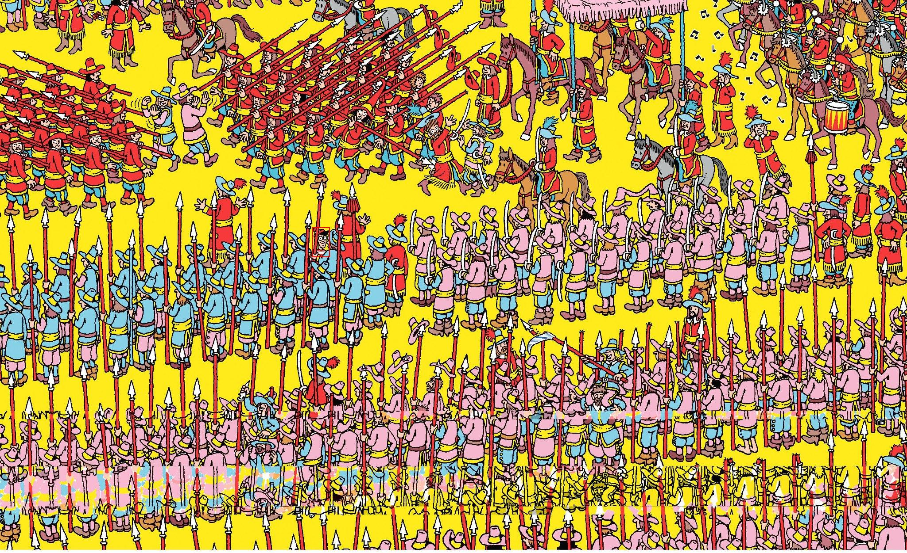

# Where's Waldo Agent

Find Waldo in a full-resolution *Where's Waldo?* illustration and return his bounding box in
original-image coordinates — using a vision-language model as a **classifier**, not as a
decision-maker.



*Input: a 2048×1251 crowd scene. Output: `bbox = [x, y, w, h]` plus the annotated image above.*

---

## Why this is hard

A *Where's Waldo* page is an adversarial needle-in-a-haystack problem, deliberately designed
to defeat exactly the heuristics a model would like to use:

- **Scale.** Waldo occupies roughly 30–50 px in a 2000 px-wide image — under 0.1% of the pixels.
  Feed the whole page to a VLM and he is gone in the downscale.
- **Decoys.** The pages are full of red-and-white stripes, round glasses and bobble hats worn by
  *other* characters. Colour or texture matching produces a flood of false positives.
- **Occlusion.** His striped shirt — the feature everyone thinks of first — is frequently hidden
  behind other figures. Only the hat and glasses are reliably visible.

The approach here: slice the page into overlapping tiles small enough for a VLM to actually see
detail, ask a cheap binary question per tile, then resolve the surviving candidates against each
other.

## How it works

This is a **deterministic workflow, not an LLM-driven agent.** Control flow is fixed in code —
one linear path plus one `if len(candidates) > 1` branch. The VLM is only ever asked to classify
or compare; it never chooses the next step.

```
[segment]   Deterministic geometry. Sliding window over the full image at a fixed
            256×256 px tile size, 15% overlap, last tile snapped to the edge.
            No VLM call.
   ↓
[detect]    gemini-3.5-flash on every tile, 10 concurrent workers.
            Binary question: "is Waldo in this patch?"
            Filter on the boolean `present` signal only.
   ↓
   ├── >1 candidate ──→ [verify]   All surviving candidates re-cropped from the
   │                                original image with 30% padding, sent to the
   │                                VLM in a SINGLE request for side-by-side
   │                                single-choice selection.
   │                        ↓
   └── ≤1 candidate ────────┴────→ [visualize]  Draw the red box, save the result.
```

Entry point is `run_pipeline(image_path)` in `agent/pipeline.py`, which returns the final state;
`stream_pipeline(image_path)` yields `(node, delta)` per step for progress reporting.

## Design decisions worth explaining

Each of these cost real API budget to establish. They are the interesting part of the project.

**Tile size is the core anchor: 256 px.**
Everything else is downstream of how much detail the model can resolve. Below ~200 px, no prompt
and no model recovers discriminative power — Waldo's absolute pixel size is simply too small.
256 px is the safe lower bound that still catches the hardest pages in the test set.

**The model's `confidence` is unusable — so it isn't used.**
`gemini-3.5-flash` returns a `confidence` field that contradicts its own `present` flag 77% of the
time, and happily assigns high scores to negatives. Sorting or thresholding on it is false
precision. Detect filters on the **binary `present` signal only**, and preserves row-major patch
order instead of a fake confidence ranking.

**Don't enumerate Waldo's features in the prompt.**
Counter-intuitive, but measured: listing "glasses / red-and-white hat" makes the model hallucinate
matches in a crowd already full of both — false positives hit 100%. Listing "striped shirt" makes
it *too* strict, because the shirt is usually occluded in a 256 px patch — recall collapses. The
best-performing prompt lists nothing and says, in effect: *use your own knowledge of Waldo; he may
be small, hidden or blurry, look carefully.*

**Verify compares candidates against each other, not one at a time.**
Judging each crop independently makes the model answer "yes" to several of them on dense pages,
misled by stripe decoys — and then the tie-break picks the wrong one. Putting every candidate in
one request and forcing a single choice (`{"choice": index, ...}`) removes the tie-break entirely
and is measurably more accurate.

**Verify is skipped when there is nothing to disambiguate.**
Detect is precise enough that most pages yield exactly one candidate. A deterministic branch sends
only multi-candidate pages through verify, which is where its cost is actually earned.

## Measured behaviour

| Metric | Value | Notes |
|---|---|---|
| Detect recall | 94.4% | Patch-level evaluation, `gemini-3.5-flash` @ 200 px |
| Detect false-positive rate | 4.9% | Same evaluation |
| End-to-end latency | ≈33 s | `1.jpg`, single-candidate fast path, no rate-limit backoff |
| Cost per image | ≈$0.09 | ~60 detect calls + 1 verify at current Gemini pricing |

Model selection was decided by the same evaluation: `gemini-3.5-flash` beat `gpt-5.5`
(recall 88.9% / FP ~20%) on the binary signal while being faster and cheaper, and both beat the
smaller/cheaper models outright.

> **Honest caveat:** these are patch-level numbers plus per-image spot checks. There is no
> ground-truth bbox annotation set yet, so end-to-end IoU accuracy is not quantified — see the
> roadmap.

## Quick start

Requires **Python 3.10+** and a **paid** Google AI Studio key (the free tier's 20 requests/day is
exhausted by a single image).

```bash
pip install -r requirements.txt
pip install python-dotenv          # optional, only needed for .env loading

echo "GOOGLE_API_KEY=your_key_here" > .env    # or export it in your shell

python main.py                     # defaults to original-images/1.jpg
python main.py original-images/2.jpg
```

Output:

```
[segment] Generated 60 patches (tile=256 overlap=0.15)
[detect] patches=60, workers=10
[detect] 1/60 patches with present=true
[visualize] Result saved → outputs/1_result.jpg  bbox=[705, 514, 39, 67]
[main] Waldo located (detect-only, verify skipped) at bbox: [705, 514, 39, 67]
```

Artifacts land in `outputs/`: individual tiles in `patches/`, verify close-ups in `verify/`, and
the annotated page as `outputs/<name>_result.jpg`.

### Browser demo

`serve.py` puts the same request handler written for the Lambda deployment behind a plain HTTP
port, so the whole flow runs in a browser with nothing extra to install — no Docker, no cloud
account:

```bash
python serve.py                    # open http://127.0.0.1:8000/
python serve.py --host 0.0.0.0     # also reachable from other devices on the LAN
```

Pick a page, wait (~33 s — the UI shows an elapsed-time counter), and the box appears. The
response carries only the bbox plus a small cropped close-up; the red rectangle is drawn
client-side on the browser's own copy of the original, so no full-size image is ever sent back.

> One detection at a time: each request clears the shared patch directory before it starts.

Run the tests (no API calls, no key needed):

```bash
pytest tests/ -q    # 58 tests: tiling geometry, JSON parsing, routing, handler, HTTP layer
```

## Project structure

```
main.py                  Local CLI runner
serve.py                 Local HTTP server for the browser demo
handler.py               Request handler (written for AWS Lambda; used by serve.py too)
config.py                Output-directory resolution (WALDO_OUTPUT_DIR)
prompts.py               DETECT_PROMPT / SELECT_PROMPT
web/index.html           Single-page front end, no dependencies
deploy/                  AWS Lambda packaging (Dockerfile + SAM template) — see roadmap
agent/
  pipeline.py            run_pipeline / stream_pipeline — plain-function orchestration
  state.py               WaldoState TypedDict
  nodes/
    segment.py           Deterministic fixed-size sliding-window tiling
    detect.py            Concurrent per-tile VLM classification
    verify.py            Side-by-side single-choice disambiguation
    visualize.py         Draw the result box
llm/                     VLM adapter layer (Gemini-only; factory kept extensible)
  base.py                BaseVLMClient + tolerant JSON extraction
  factory.py             get_vlm_client(provider)
  providers/gemini_client.py
vision/                  Pure image work, no VLM
  segment.py             tile_region + patch→original coordinate mapping
  image_utils.py         Crop / encode / save
tools/visualize.py       bbox rendering
tests/                   Core-logic unit tests
original-images/         Test pages
```

## Tunable parameters

| File | Parameter | Default | Purpose |
|---|---|---|---|
| `agent/nodes/segment.py` | `TILE_SIZE` | 256 | Tile edge length in px — the key accuracy/cost knob |
| | `TILE_OVERLAP` | 0.15 | Stops Waldo being split across a tile boundary |
| | `MIN_PATCH_PX` | 150 | Skip tiles too small to be readable |
| `agent/nodes/detect.py` | `MAX_CONCURRENT` | 10 | Parallel VLM calls (tuned for paid Tier 1, ~300 RPM) |
| | `MAX_PATCHES_PER_ITER` | 80 | Hard tile cap; excess is sampled randomly, not truncated, to avoid systematically missing one corner |
| | `MAX_RETRIES` / `RETRY_BASE_WAIT` | 4 / 15 s | 429 backoff: 15→30→60→120 s |
| `agent/nodes/verify.py` | `VERIFY_MAX` | 12 | Safety cap on candidates sent for comparison |
| | `PADDING_RATIO` / `MIN_VERIFY_SIZE` | 0.3 / 120 px | Context padding around each verify crop |

## Tech stack

Python 3.10+ · Pillow · `google-generativeai` (`gemini-3.5-flash`) ·
`concurrent.futures.ThreadPoolExecutor`. Two runtime dependencies, no agent framework — an earlier
LangGraph version was removed once it was clear the graph encoded a single deterministic branch.

## Roadmap

- [ ] **Deploy on AWS Lambda** *(on hold)* — container image behind a Function URL, synchronous
      image-in/result-out. Architecture is settled and the code is done: `handler.py`, `config.py`
      and `deploy/` (Dockerfile + SAM template) are in the repo and unit-tested, and local timing
      (≈33 s) sits comfortably inside the 15-minute Lambda ceiling. The image has never been built
      — that needs a Docker/SAM/AWS toolchain this project does not currently justify, so
      `serve.py` covers demos instead.
- [ ] **Quantitative evaluation** — ground-truth annotations for `original-images/` plus an IoU
      hit-rate script, to replace per-image visual inspection.
- [ ] **Network robustness** — detect already backs off on 429, but 503/504 and connection errors
      should be retried too; and billing-type 429s should fail fast instead of burning ~27 minutes
      of pointless backoff.
- [ ] **Tile-size sweep** — 256 vs 384 recall/latency trade-off, once the evaluation harness exists.
- [ ] **Migrate to `google.genai`** — `google.generativeai` is deprecated upstream.

---

<sub>Course project scaffold:
[](https://classroom.github.com/a/-bKyY6qM)
[](https://classroom.github.com/online_ide?assignment_repo_id=23978583&assignment_repo_type=AssignmentRepo)</sub>
